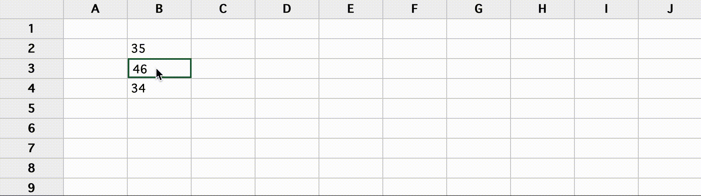

# Spreadsheet

This repo contains the code powering a simple spreadsheet-like React component.



## How to run the code

Unzip an run

```
yarn
```

to fetch the dependencies, and

```
yarn start
```

will run and open the app in the default browser on port `3000`.

## Use

The table is sized by `x` and `y` in `src/App.jsx`:

```
<Table x={10} y={4} id={'1'} />
```

You can also add more than one table, just choose a different `id` prop to play well with the localStorage saving.

## Current limits

- Only lists labels for the columns a-z, past z it's not showing the label
- No keyboard navigation